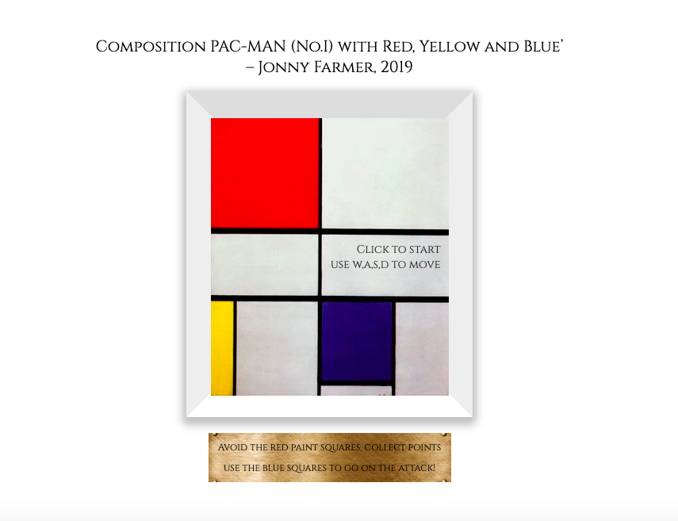
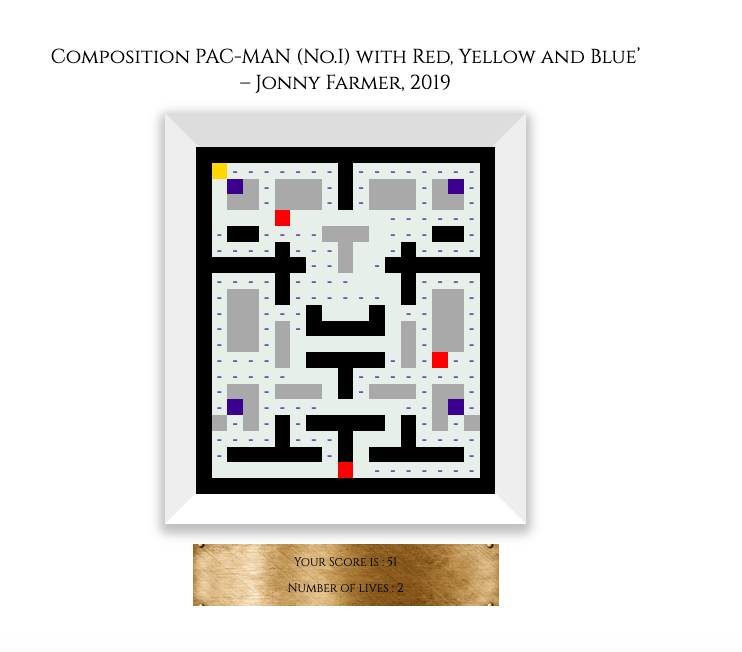

# Project One : PAC-MAN


## Overview
My first project was is a browser based arcade style game based on the original PAC-MAN.  The challenge is to get all of the pips whilst avoiding the Ghosts.

This was my first project from General Assembely Software Engineering Immersive course. It was an individual project that I build within a week, and was both my first game I had built.

Launch on [GitHub Pages](https://jonnysfarmer.github.io/project-1/).  Check out the GitHub [Repo](https://github.com/jonnysfarmer/project-1).


## Brief
* Render a grid-based game in the browser
* Include seperate HTML / CSS / Javascript files
* Use of Javascript for DOM manipulation
* Including winning and loosing mechanisms
* Design logic for Ghost interaction with eachother and PAC-MAN
* Deploy game online using Github pages
* Must display final score

## Technologies Used
* HTML5
* CSS3
* JavaScript (ES6)
* Git
* GitHub
* Google Fonts

## Approach Taken
### Grid Layout & Geneation
I initiall planned out my grid by using an array of arrays generating divs within a flexbox.  Each array corresponding to a row, then within that each value corresponding to a cell.  This meant with the movement function, it could easily move up or down a row, as well as left and right across cells.

Depending on the number within the array, the div would then be given a specific class.  This would either be 'wall', 'empty', 'fruit', 'pill', 'ghost' or 'pacman'.  This was assigned using a Switch function.

This allowed me to easily manipulate my game board and create new ones if wanted in the future.  This was done by using a forEach, within a forEach (which although not great for the Big O, was fine for a pre defined board size).  

```javascript
  function createBoard() {
    pacmanBoard.forEach((ele, i) => {
      const row = document.createElement('div')
      const rows = []
      row.classList.add(`row${i}`)
      grid.appendChild(row)
      ele.forEach((inele) => {
        const cell = document.createElement('div')
        assignCellClass(inele, cell)
        row.appendChild(cell)
        rows.push(cell)
      })
      board.push(rows)
    })
  }
  
    function assignCellClass(inele, cell) {
    switch (inele) {
      case 0: cell.classList.add('wall'); break
      case 1: {
        cell.classList.add('fruit')
        cell.innerHTML = '-'
      } break
      case 2: cell.classList.add('empty'); break
      case 3: {
        cell.classList.add('ghost')
        cell.classList.add('empty')
      } break
      case 4: cell.classList.add('pill'); break
      case 5: cell.classList.add('pacman');  break
      case 6: cell.classList.add('wallGrey'); break
    }
  }
```


### PAC-MAN
PAC-MAN's movement was created by using a keyup event listener.  one the w,a,s,d keys being pressed it would create a setInterval function moving the PAC-MAN at a defined speed at in that directon before until another key is pressed or it hits an obsticle.  

Depending on the class of the next grid tile you are attempting to move to, PAC-MAN replaces that, gaining 1 point for every 'fruit' eaten, loosing a life and respawning for every 'ghost' hit and gaining an additional class (removed after a specific time period using a setTimer function) of 'activate' when a pill is eaten.  During this time PAC-MAN can attack the ghosts causing them to respawn at their start location.

If PAC-MAN hits a Ghost, he respawns at his original point (with a reserve point if a Ghost is already in that location), and looses a life.

### Ghosts
#### Movement & the chase
The basic movement function of the Ghosts were simple.  I made the class Ghost more specific than than of 'empty' or 'fruit' so it did not need to replace it like that of PAC-MAN.

The logic of the chase.  The Ghosts have 4 different movement functions with a specific order.  ULDR (Up, Right, Down, Left), with this function, the Ghost will always try and move up first, if that is not possible, it will then try move Right and so on.  The other functions are LDRU, DRUL, RULD. 

The logic is that if the Ghost is on the same Row or Column as Pacman - it will always chase it directly.

If it is not, there is a counter.  Every multiple of 2 it will try and move vertically towards it, and every odd number it will try and move horizontally towards PAC-MAN.  This creates a chase function with some random variance.  The Ghosts also push their last co-ordinates to an array and are not allowed to go back on themselves (similar to the original PAC-MAN).

This logic reverses when PAC-MAN has the class of 'activate' once he eats a pill.  The Ghosts then actively run away from PAC-MAN to avoid being eaten.  

All Ghosts have the same logic, but slightly different starting points (in the Ghost base), and different speeds.

#### Interactions
##### Ghost - Ghost
When interaacting with other Ghosts, they promptly reverse to their last position (which was logged in their history array), and their history is then updated with their last position meaning unless they hit another Ghost, they can not go back on themselves again.  This works succesfully.
##### Ghost - PAC-MAN
If it is the Ghosts turn to move and PAC-MAN (without the activate class) is in a adjacent valid square, the Ghost will automatically move to that square, this causes PAC-MAN to respawn at its start location (with a reserve if that already has a Ghost on it), and loose a life.

When PAC-MAN looses all 3 lives, this is the end of the game.

If PAC-MAN manages to catch up with the Ghosts whist he has the 'activate' class on him (ie. after eating a blue pill), this will cause the Ghost to respawn at its original location.

### Styling
My styling inspiration came from a recent trip to the Tate Modern, 'Composition C (No.III) with Red, Yellow and Blue'.  I decided on a simplistic design, with the picture in a CSS designed frame, which than transforms into my board using the same colour palette.  The instructions, score and life variables are then displayed on a picture description sytle plaque underneath.

On game completion (loss of all lives, or hitting total score), the picture then comes back up displaying your score.  If you click on the picture, it resets the board and allows you to play again.


## Screenshots



## Wins & Blockers
Overall I really enjoyed this project.  It was a steep learning curve going from learning individual functions to a project like this.  I now fully apprecaite the use of Psydoscde but found it interesting.
I rewrote my ghost movement logic 4 times to improve my Ghost movements and know in hindsight I could of done this in a lot more efficient code (and still intend to go back and refractor at some point).  
I had to rewrite my ghost - ghost interaction a few times, as it sometimes went through walls (which is now fixed).

## Future Features
* Have a permenant saved scoreboard using local storage
* Multiple maps / grid layouts
* easy / medium / hard mode with different numbers of ghosts and/or speeds


